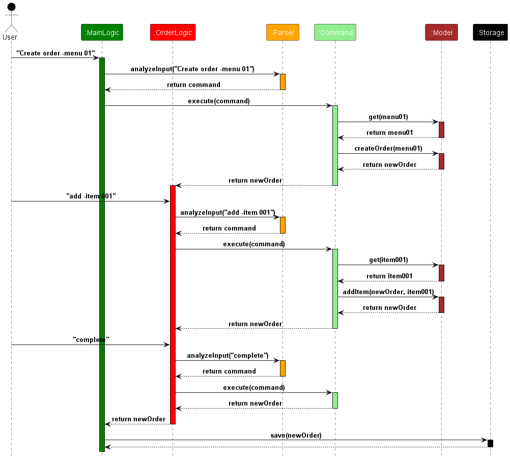
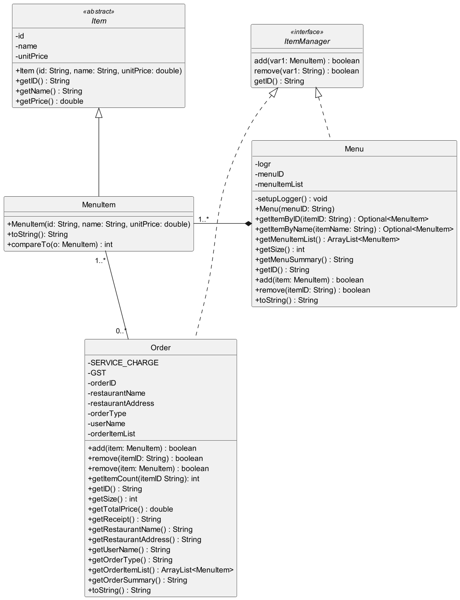
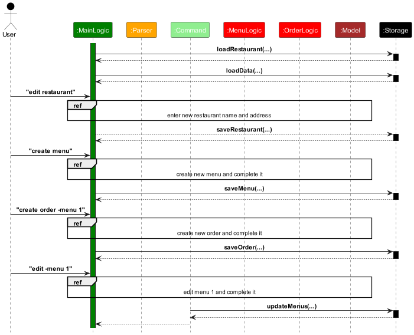
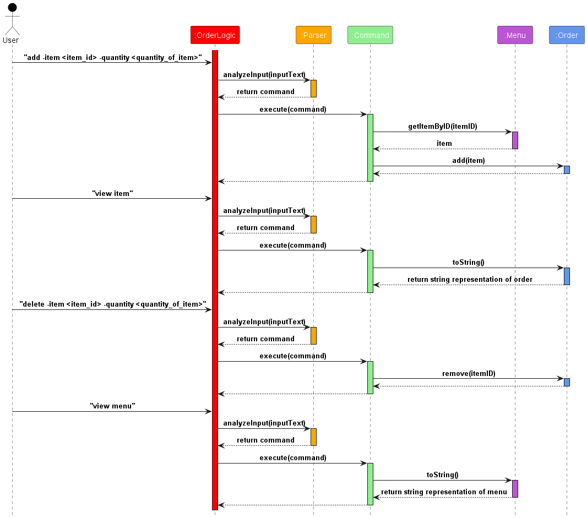
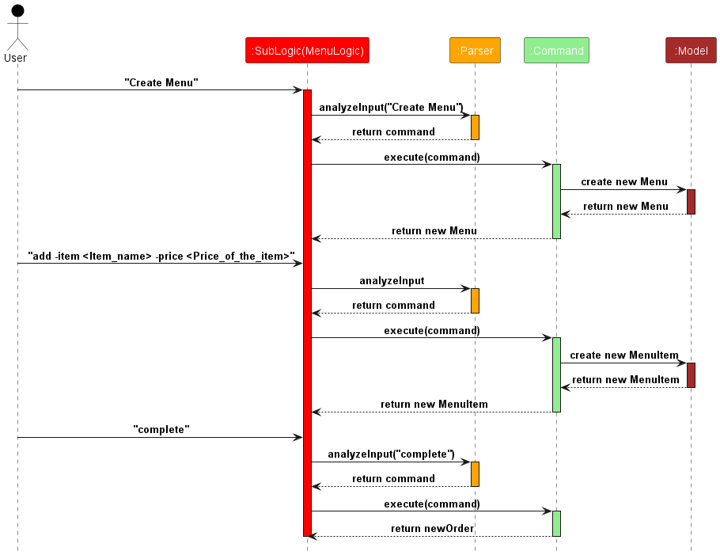

# Developer Guide

## Acknowledgements

{list here sources of all reused/adapted ideas, code, documentation, and third-party libraries -- include links to the original source as well}

## Design

### Architecture


The **Architecture diagram** given above shows the high-level design of the application.

Given below is a quick overview of main components and how they interact with each other.

**`Main`** is in charge of the app launch, shut down, and taking user input.

* At the app launch, it loads the data from the file system, and initializes other components.
* At the app shut down, it saves the data to the file system, and shuts down other components.

The app's work is done by the following components:

* [**`UI`**](#UI-component): The parser that parses user input to command.
* [**`MainLogic`**](#logic-component): The main logic command executor.
* [**`SubLogic`**](#logic-component): The sub logics(i.e. **`MenuLogic`**, **`OrderLogic`**) command executor.
* [**`Model`**](#model-component): The data model that stores the data.
* [**`Command`**](#command-component): Represents a command that the user can execute.
* [**`Storage`**](#storage-component): Reads data from, and writes data.

**How the architecture components interact with each other**

The *Sequence Diagram* below shows how the components interact with each other for the scenario where the user issues 
the command `create order -menu 1`, `add -item 1` and `complete`.

 

### UI Component
The UI component is responsible for parsing user input into commands that can be executed by the logic component.
There is a `analyzeInput` method in the `Parser` class that interprets the user input and classifies 
it into a `CommandType` enum.<br>
The `splitInput` method is used to split the user input into an array of strings, according to the command type.
It returns an array containing any arguments that are needed to execute the command.

### Logic Component
The logic component consists of classes that handle the logic of the application. The logic component is divided into
`MainLogic` and `SubLogic` which consists of `OrderLogic` and `MenuLogic`.

* [**`MainLogic`**](#model-component): A class to handle the first level commands, and pass the user input to corresponding
classes for analysis and execution.
* [**`OrderLogic`**](#model-component) and [**`MenuLogic`**](#model-component): A class to handle the second level commands,
and pass the user input to corresponding classes for analysis and execution.

### Command Component
The command component consists of two different command interfaces: `MainCommand` and `OrderCommand`. The `MainCommand`
interface is for the various command classes that are used in the `MainLogic`, while the `OrderCommand` interface is for
command classes used in `OrderLogic`.  

A `Command` object will be created in either the `MainLogic` or `OrderLogic`
based on what command the user has inputted(e.g., `MainHelpCommand` object is created when the user inputs the `help`
command). The `execute()` method of the `Command` object is then called to execute the command, which may require
certain arguments based on the type of command.

### Model Component
The model consists of classes describing the objects used in this application.
The general structure is that menu and order are separate, but they both work with `menuItem(s)`, which 
represent food items on the menu.

* [**`ItemManager`**](#model-component): An interface containing methods representing operations common to **`Menu`** 
  and **`Order`**. <br><br />
* [**`Item`**](#model-component): An abstract class representing a food item. It should be implemented by **`MenuItem`**.
  <br><br />
* [**`Menu`**](#model-component): A class representing the menu(s) of the restaurant, where each contains menuItem(s)
 that can be ordered. Multiple menus can exist and each has a unique ID. <br><br />
* [**`MenuItem`**](#model-component): A class inheriting item, and represents a food item on the menu. <br><br />
* [**`Order`**](#model-component): A class representing an order to be entered into the system to be kept track of. Each 
  order has a unique ID generated from the time of order.<br><br />

The *Class Diagram* below shows how the model components interact with each other, including interactions such as 
dependencies, associations and inheritance.



### Storage component
The storage component consists of a `Storage` class with various static methods that will be called by `MainLogic` and
the `Command` objects created in `MainLogic`. These methods will be called whenever restaurant information is updated,
a new order or menu is completed, and when an existing menu is edited and completed. Restaurant information, orders,
and menus are saved in three separate text files: `restaurant.txt`, `orders.txt`, and `menus.txt`.

When the application is launched, `MainLogic` calls the `loadRestaurant()` method to check for an existing restaurant
data file in the data folder. If the `restaurant.txt` file is missing from the data folder, the user will be prompted to
enter a restaurant name and address, which is then automatically saved in the save file.

`MainLogic` then calls the `loadData()` method in `Storage` to load existing order and menu data from `orders.txt` and
`menus.txt` into the application. If `Storage` detects that the save files are corrupted, the corresponding save file
will be deleted from the data folder.

When new orders and menus have been created and completed, once control is passed back from `SubLogic` to `MainLogic`,
`MainLogic` will then call either `saveOrder()` or `saveMenu()` depending on what was created. The newly created
order/menu will then be saved into their respective save file.

After the user edits a menu and completes it with the `complete` command, the `execute()` method of the `Command` object
created by `MainLogic` will then call the `updateMenus()` method in `Storage`. This will save all the changes made to
the menu into the `menus.txt` save file. The `execute()` method then returns to `MainLogic` for further commands.

The following _sequence diagram_ shows an example of how `Storage` interacts with the other components as described
above.



## Implementation

### `MainLogic`
Generally, the main logic works as follows:
1. User enters an input which is received in the *ui* and parsed by the `Parser`.
2. The `Parser` classifies the command based on `CommandType`.
3. If it is a first level command, `execute` is called on the corresponding class.
4. If it is not a first level command, the command will be pass to `SubLogic` to handle.

**Create Order** <br>
`Mainlogic` takes user input and creates an `Order` class , then passes it to `OrderLogic` to execute the command.

**View Order by ID** <br>
`Mainlogic` takes in the command and the order ID, execute the `view order` command by calling a static method<br>
in `ViewOrderCommand` class.

**View all orders** <br>
`Mainlogic` takes in the command and calls the `ViewOrdersSummaryCommand` class to execute the command<br>    
by querying the orderList.

**View Receipt** <br>
`Mainlogic` takes in the command and calls the `ViewReceiptCommand` class to execute the command

### `OrderLogic`
The following *sequence diagram* shows an example of how the user's input is processed by `OrderLogic`.



Generally, the order logic works as follows: 
1. User enters an input which is received in the *ui* and parsed by the `Parser`. 
2. The `Parser` classifies the command based on `CommandType`
3. Within `OrderLogic`, `execute` is called on the corresponding class
4. Control is passed to other sections of the code

**View Menu** <br>

Within the construct of the order logic, the menu can be accessed for viewing in order to select items from 
available menus. This is carried out with the `view menu` command.

**View Item**  

Within `OrderLogic`, a list containing all the items that have been added to the current active order can be viewed by executing
the `view item` command.

**Add**  

Inside `OrderLogic`, items from the menu can be added into the current active order.
This is carried out using the `add -item <item_id> -quantity <quantity_of_item>` command,
where `<item_id>` is an integer corresponding to the item's id in the menu,
and `<quantity_of_item>` is an integer of the amount of that item to be added.

**Delete**  

In `OrderLogic`, items from the current order can be removed via the
`delete -item <item_id> -quantity <quantity_of_item>` command. `<item_id>`
and `<quantity_of_item>` are the same type of parameters as the ones specified
in the `Add` command class.

**Complete**  

In `OrderLogic`, once the order is finished, it can be completed and closed
by executing the `complete` command. This marks the current order as completed
and the program returns back to `MainLogic` for subsequent command executions.

**Cancel**

In "OrderLogic", the user can cancel the current order by executing the `cancel` command.
This will abort the current order created and return to the main menu.

### `MenuLogic`

Generally, the menu logic works similar to order logic:
1. User enters an input which is received in the *ui* and parsed by the `Parser`.
2. The `Parser` classifies the command based on `CommandType`
3. Within `MenuLogic`, `execute` is called on the corresponding class
4. Control is passed to other sections of the code

**View Item**  

Within `MenuLogic`, a list containing all the items that have been added to the current active order can be viewed by executing
the `view item` command.

**Add**

Inside `MenuLogic`, items from the menu can be added into the current active order.
This is carried out using the `add -item <item_name> -price <price_of_item>` command,
where `<item_name>` is a string represent the name of the MenuItem,
and `<price_of_item>` is a double of the price of that item to be added.

**Delete**

In `MenuLogic`, items from the current order can be removed via the
`delete -item <item_id>` command. `<item_id>` is the index of the item in the menu.

**Complete**

Inside `MenuLogic`, once the order is finished, it can be completed and closed
by executing the `complete` command. This marks the current Menu as completed
and the program returns back to `MainLogic` for subsequent command executions.

**Cancel**
In `MenuLogic`, the user can cancel the current menu by executing the `cancel` command.
This will abort the current menu created and return to the main menu.

## Product scope
### Target user profile

* has a need to manage orders in a restaurant
* has a need to manage menus in a restaurant
* has a need to manage cashiering duty in a restaurant
* prefer CLI apps than GUI apps
* can type fast


### Value proposition

Manage orders and menus faster and more efficiently than traditional GUI applications for faster typers.

## User Stories

| Priority | As a ...         | I want to ...                             | So that I can ...                                               |
|----------|------------------|-------------------------------------------|-----------------------------------------------------------------|
| `* * *`  | restaurant owner | Add dishes to order/menu                  | easily refer and calculate the total price                      |
| `* * *`  | restaurant owner | Delete dishes to order/menu               | remove the dishes that the customers do not want                |
| `*   *`  | restaurant owner | view the order receipt                    | check the order details and the total price                     |
| `* * *`  | restaurant owner | manage cashiering duties in my restaurant | keep track of the money that comes in and out of the restaurant |
| `*   *`  | restaurant owner | manage menus in my restaurant             | keep track of the dishes that are available in the restaurant   |
| `*    `  | restaurant owner | view the order/menu                       | check the dishes that are available in the restaurant           |


## Non-Functional Requirements

* Should Work on any mainstream OS as long as it has Java 11 or above installed.
* Should be able to handle and save a large number of orders and menus for restaurant's daily operations.
* Faster type can use the CLI app more efficiently than GUI app

## Glossary

* **Mainstream OS**: Windows, Linux, Unix, MacOS.


## Instructions for manual testing
Written below are instructions to test the app manually.

### Launch and shutdown
* Initial launch
  1. Download the jar file and copy into an empty folder
  2. Open a terminal and navigate to the folder containing the jar file
  3. Run the command `java -jar DinEz.jar` to launch the application
* Shutdown
  1. Type `exit` and press enter to shutdown the application

### Add item to a menu
* Adding an item to a menu
  1. Prerequesite: Type `create menu` in the Main interface to go into the Menu interface.
  2. Test case: `add -item Beef noodles -price 6`  
     Expected: A new item with the name `Beef noodles` and a price of `$6.00` is added to the menu. A success message
     should also appear.
  3. Test case: `add -item Beef noodles -price abc`  
     Expected: Item is not added to menu. Error message appears asking users to check if they have entered the necessary
     parameters correctly.
  4. Other incorrect add commands to try: `add`, `add -item -price`, `add -item 123 -price 12`, `...`  
     Expected: Similar to previous.

### Delete item in the menu
* Deleting an item from the menu based on its ID
  1. Prerequisite: Have already added some items to the menu with the `add` command.
  2. Test case: `delete -item 1`
     Expected: Item with ID 1 is deleted from the menu. Message appears indicating the name of the removed item has
     been deleted.
  3. Test case: `delete -item abc`  
     Expected: No item is deleted. Error message appears asking users to check if they have entered the necessary
     parameters correctly.
  4. Other incorrect commands to try: `delete`, `delete -item x`, `...` (where x is larger than the last item ID in the
     menu)  
     Expected: Similar to previous.

### Create order and add/delete/view item
* To create an order
  1. Prerequisite: Have already created one menu. Type `create order -menu 1` in Main interface to enter the Order
     interface, 1 is the ID of the previously created menu.
  2. Test Case: `Add -item 1 -quantity 2`  
     Expected: Item 1 is added to the order with quantity 2
  3. Test Case: `View item`  
     Expected: Item 1 is displayed with quantity 2
  3. Test Case: `Delete -item 1 -quantity 1`  
     Expected: Item 1 is removed from the order with quantity 1

### View created orders
* To view all orders or details of a specific order that has been created
  1. Prerequisite: Must have already created and completed orders.
  2. Test case: `view -order -all`  
     Expected: A list of order IDs should appear with their corresponding total price
  3. Test case: `view -order <order_id>` (where `<order_id>` is an order ID from the list obtained from
     `view -order -all`)  
     Expected: A receipt on the order should appear on the screen.
  4. Test case: `view -order abc`  
     Expected: Error message appears asking users to check if they have entered the necessary parameters correctly.
  5. Other incorrect commands to try: `view -order`, `view -order x`, `...` (where x is an order ID that does not exist
     in the list of orders from `view -order -all`)  
     Expected: Similar to previous.

### View created menus
* To view all menus or details of a specific menu that has been created.
  1. Prerequisite: Must have already created and completed menus.
  2. Test case: `view -menu -all`  
     Expected: A list of menu IDs should appear with their corresponding amount of items that the menu contains
  3. Test case: `view -menu 1`  
     Expected: Details of the menu should appear which includes the ID, name and price of every item in the menu.
  4. Test case: `view -menu abc`  
     Expected: Error message appears asking users to check if they have entered the necessary parameters correctly.
  5. Other incorrect commands to try: `view -menu`, `view -menu x`, `...` (where x is a menu ID that does not exist
     in the list of menus from `view -menu -all`)  
     Expected: Similar to previous.

### Loading data
All save files should be located in the data folder, and the data folder must be in the same directory as the jar file.

#### Load restaurant data
In the data folder, create a file named `restaurant.txt` and enter the following data:
```
Techno Edge | 2 Engineering Drive 4
```
> [!NOTE]
> * If the `restaurant.txt` file is not present in the data folder when the program is run, it assumes the user is a
> first-time user and will not load data from `orders.txt` and `menus.txt` if present.

#### Load order data
In the data folder, create a file named `orders.txt` and enter the following data:
```
Techno Edge | 2 Engineering Drive 4
20240412112658 | Tom | Dine in
1 | Kimchi noodles | 4.0 | 2
3 | Chicken rice | 3.5 | 1
-

```
> [!NOTE]
> * There **must** be a newline after the `-` which indicates the end of the order. If the newline is omitted and the user
> uses program to create new orders, it will result in the **LOSS OF ORDER DATA** the next time the program is
> launched.

#### Load menu data
In the data folder, create a file named `menus.txt` and enter the following data:
```
1
1 | Chicken Rice | 3.5
2 | Nasi Lemak | 3.0
3 | Hokkien Mee | 4.0
4 | Mee Siam | 3.5
5 | Fishball Noodles | 3.0
6 | Chicken Curry Rice | 5.0
7 | Seafood Fried Rice | 5.5
8 | Roasted delight set | 6.5
9 | Hotplate beef set | 7.0
10 | Kimchi noodles | 4.0
-

```
> [!NOTE]
> * There **must** be a newline after the `-` which indicates the end of the menu. If the newline is omitted and the user
> uses program to create new menus, it will result in the **LOSS OF MENU DATA** the next time the program is launched.

#### View loaded data
Launch the application by running the `DinEz.jar` file which is in the same directory as the data file. The application
should load the data from the save files and the user should see the following:
```
Hello from DinEz
Enter user name: 

```

Once the user has entered their user name, they should see the following when `view restaurant` is entered in the main
interface:
```
Restaurant name: Techno Edge
Restaurant address: 2 Engineering Drive 4
```

The user should see the following when `view -order 20240412112658` is entered
in the main interface:
```
+-----------------------------------------------------+
|                       RECEIPT                       |
+-----------------------------------------------------+
|                     Techno Edge                     |
|                2 Engineering Drive 4                |
|                                                     |
| Order Type: Dine in                                 |
| Order ID: 20240412112658                            |
+-----------------------------------------------------+
| Item ID  | Name            | Unit Price  | Quantity |
+-----------------------------------------------------+
| 1        | Kimchi noodles  | $4.00       | 2        |
| 3        | Chicken rice    | $3.50       | 1        |
+-----------------------------------------------------+
| Subtotal:                                    $11.50 |
+-----------------------------------------------------+
| Service Charge (10.0%):                      $1.15  |
| GST (9.0%):                                  $1.14  |
| Grand Total:                                 $13.79 |
+-----------------------------------------------------+
| Cashier: Tom                                        |
+-----------------------------------------------------+

```

The user should see the following when `view -menu 1` is entered in the main
interface:
```
+------------------------------------------+
|                   MENU                   |
+------+-----------------------------------+
| ID   |         Name          | Price     |
+------+-----------------------------------+
| 1    | Chicken Rice          | $3.50     |
| 2    | Nasi Lemak            | $3.00     |
| 3    | Hokkien Mee           | $4.00     |
| 4    | Mee Siam              | $3.50     |
| 5    | Fishball Noodles      | $3.00     |
| 6    | Chicken Curry Rice    | $5.00     |
| 7    | Seafood Fried Rice    | $5.50     |
| 8    | Roasted delight set   | $6.50     |
| 9    | Hotplate beef set     | $7.00     |
| 10   | Kimchi noodles        | $4.00     |
+------+-----------------------------------+

```

### Saving data
Data is automatically saved into the respective save files once the corresponding action has been completed. The
following tests uses the loaded data from [Loading Data](#loading-data)

#### Saving restaurant information
After launching the application, enter `edit restaurant` in the main interface and enter `Fine Food` when prompted for
restaurant name, and `Avenue 0` when prompted for restaurant address. The new restaurant information will then be
automatically saved once the message `Restaurant info has been updated.` appears. The user should see the following:
```
[Main interface] >>> edit restaurant
Enter restaurant name: 
Fine Food
Enter address of restaurant: 
Avenue 0
Restaurant info has been updated.
[Main interface] >>> 
```

#### Saving orders
After launching the application, enter `create order -menu 1` in the main interface. Enter `1` when prompted for the
order type (dine in/takeaway). Enter the following commands in sequence inside the order interface:
`add -item 2 -quantity 3`, `add -item 4 -quantity 1`. Afterwards, enter `complete`in the order interface and type `y`
when the confirmation message appears. The completed order is then automatically saved in the `orders.txt` file inside
the data folder. The user should see the following:
> [!NOTE]
> * `order_id` is just a placeholder for the actual ID of the order depends on the time the user creates the order and
> differs from order to order.
> * `...` represents abbreviated messages to shorten the example output

```
[Main interface] >>> create order -menu 1
Would you like your order to be
    1) dine in
    2) takeaway
Please enter 1 or 2: 
1
Order order_id creating...
Here are the list of available commands:
    help: Shows all the commands that can be used.
    ...
    cancel: Aborts the current order and returns to the main menu.
[Order: order_id] [Menu: 1] >>> add -item 2 -quantity 3
3 Nasi Lemak is added to order
[Order: order_id] [Menu: 1] >>> add -item 4 -quantity 1
1 Mee Siam is added to order
[Order: order_id] [Menu: 1] >>> complete
...
WARNING: Once an order is completed, you are NOT ALLOWED to edit or delete it.
Do you want to complete the order? (type 'y' to complete, anything else to cancel)
y
Order order_id is completed!
[Main interface] >>> 
```

#### Saving menus
After launching the application, enter `create menu` in the main interface. Next, enter the following commands in
sequence inside the menu interface: `add -item Beef noodles -price 6`, `add -item Prawn noodles -price 5`. Enter
`complete` in the menu interface, and the newly created menu will be saved in the `menus.txt` file inside the data
folder. The user should see the following:
> [!NOTE]
> * `...` represents abbreviated messages to shorten the example output

```
[Main interface] >>> create menu
Initializing menu 2...
Here are the list of available commands:
    help: Shows all the commands that can be used.
    ...
    cancel: Aborts the current menu and returns to the main menu.
[Menu: 2] >>> add -item Beef noodles -price 6
Item successfully added to menu!
+------------------------------------------+
|                   MENU                   |
+------+-----------------------------------+
| ID   |         Name          | Price     |
+------+-----------------------------------+
| 1    | Beef noodles          | $6.00     |
+------+-----------------------------------+

[Menu: 2] >>> add -item Prawn noodles -price 5
Item successfully added to menu!
+------------------------------------------+
|                   MENU                   |
+------+-----------------------------------+
| ID   |         Name          | Price     |
+------+-----------------------------------+
| 1    | Beef noodles          | $6.00     |
| 2    | Prawn noodles         | $5.00     |
+------+-----------------------------------+

[Menu: 2] >>> complete
Menu 2 has been saved!
[Main interface] >>> 
```

#### Viewing the saved data
Inside the data folder, open `restaurant.txt`. It should be populated with the following data:
```
Fine Food | Avenue 0
```
Inside the data folder, open `orders.txt`. It should be populated with the following data:
```
Techno Edge | 2 Engineering Drive 4
20240412112658 | Tom | Dine in
1 | Kimchi noodles | 4.0 | 2
3 | Chicken rice | 3.5 | 1
-
Fine Food | Avenue 0
20240414012735 | Jack | Dine in
2 | Nasi Lemak | 3.0 | 3
4 | Mee Siam | 3.5 | 1
-

```
Inside the data folder, open `menus.txt`. It should be populated with the following data:
```
1
1 | Chicken Rice | 3.5
2 | Nasi Lemak | 3.0
3 | Hokkien Mee | 4.0
4 | Mee Siam | 3.5
5 | Fishball Noodles | 3.0
6 | Chicken Curry Rice | 5.0
7 | Seafood Fried Rice | 5.5
8 | Roasted delight set | 6.5
9 | Hotplate beef set | 7.0
10 | Kimchi noodles | 4.0
-
2
1 | Beef noodles | 6.0
2 | Prawn noodles | 5.0
-

```

### Corrupted save files
Generally, if a save file is corrupted, it will be deleted from the data folder. Hence, users **should not** edit the
save files directly, else they risk losing all their data.

#### Corrupted restaurant save file
In the data folder, locate `restaurant.txt` and open it. Fill in the file with the following data:
```
Fine Food Avenue 8
```
Upon launching the application by running the jar file, the program will prompt the user for a restaurant name and
address, similar to when launching the application for the first time. The user should see the following:
```
Hello from DinEz
Enter restaurant name: 

```

#### Corrupted order save file
In the data folder, locate `orders.txt` and open it. Fill in the file with the following data:
```
Fine Food | Avenue 0
20240414012735 | Jack | Dine in
2 | Nasi Lemak | 3.0 | 3
4 | Mee Siam 3.5 abcdef
-

```
Upon launching the application by running the jar file, the program detects that the order save file is corrupted
and deletes `orders.txt` from the data folder. The user should see the following (provided the restaurant save
file is not corrupted):
```
Hello from DinEz
Order data corrupted, erasing data...
Enter user name: 

```

#### Corrupted menu save file
In the data folder, locate `menus.txt` and open it. Fill in the file with the following data:
```
02
1 | Beef noodles | abcabc
2 | Prawn noodles | 5.0
-
```
Upon launching the application by running the jar file, the program detects that the menu save file is corrupted
and deletes `menus.txt` from the data folder. The user should see the following (provided the restaurant save
file is not corrupted):
```
Hello from DinEz
Menu data corrupted, erasing data...
Enter user name: 

```
